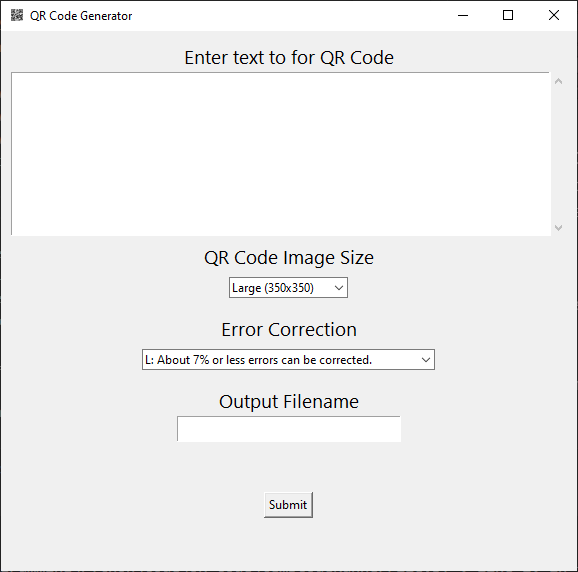
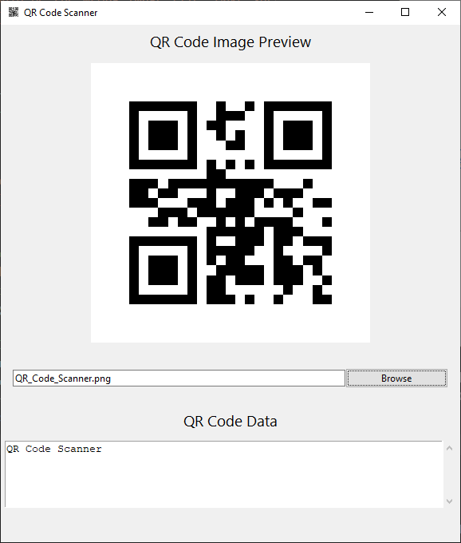
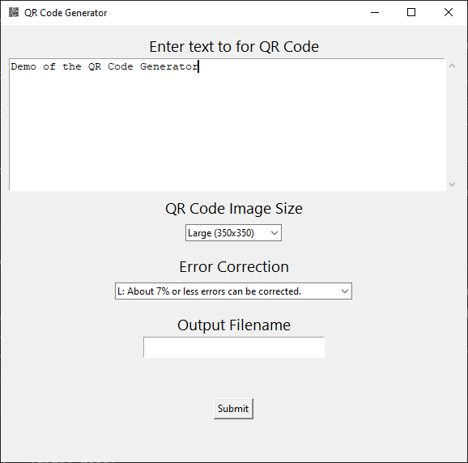
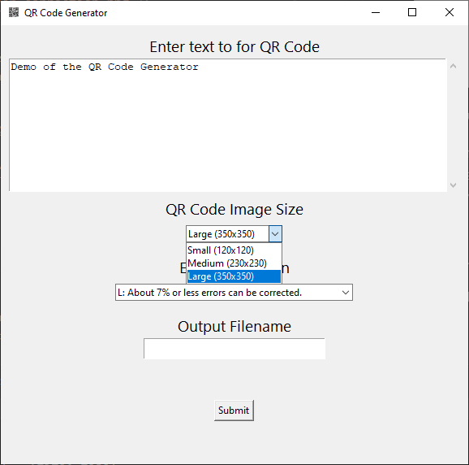
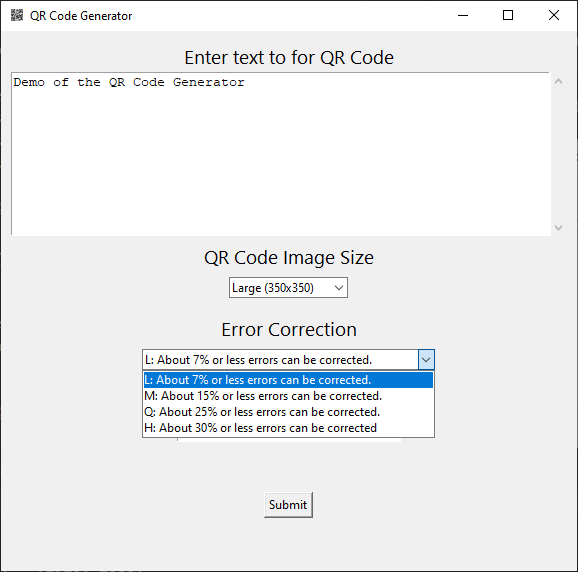
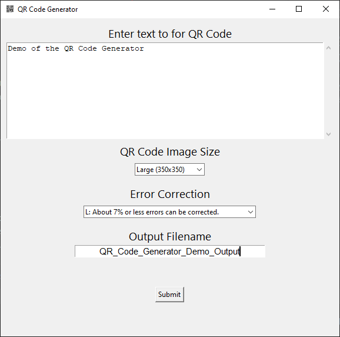
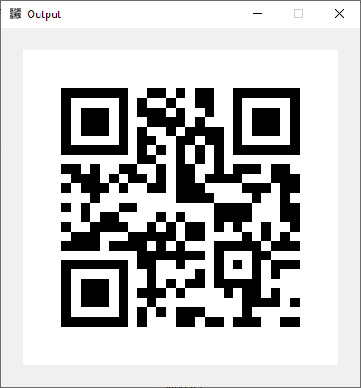
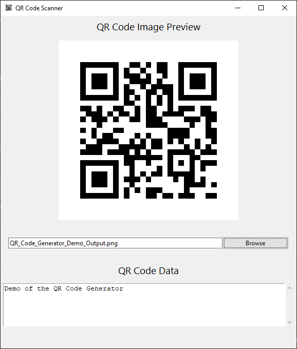
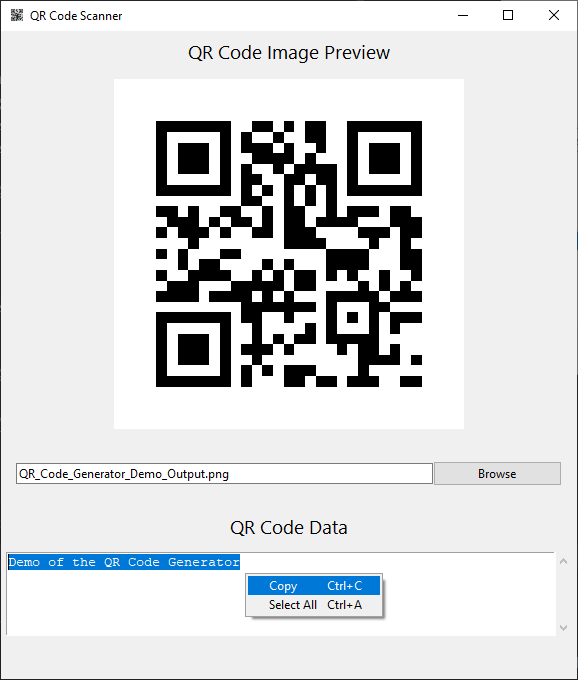

# QR Code Generator & Scanner

<p align="center" width="100%">
  
</p>
<br>
<p align="center" width="100%">
  
</p>

Python implementation of a QR Code Generator & Scanner with a Graphical User Interface (GUI).  

#### Features:
- ✨Fully **OFFLINE**
- 💻 Graphical User Interface (GUI)
- 🎛️ Control output image size and amount of error correction
- 📷 Save the QR Code as an PNG image file (.png)
<br><br>

## Table of Contents
- [Prerequisites](#prerequisites-heading)
- [Dependencies](#dependencies-heading)
- [Usage](#usage-heading)


<a name="prerequisites-heading"></a>
## Prerequisites
Python 3.x (tested in version 3.12.2)

<a name="dependencies-heading"></a>
## Dependencies
### qrcode 8.1 &amp; PIL

The `qr_code_generator.py` uses `qrcode` and `PIL` libraries. For more image functionality, qrcode is installed with the PIL dependency so that pillow can be used for generating images. The pip command for installing `qrcode` with `PIL` is given below. 

```console
pip install "qrcode[pil]"
```  

#### qrcode References
- [PyPI](https://pypi.org/project/qrcode/)
- [Github](https://github.com/lincolnloop/python-qrcode)

The `qr_code_scanner.py` uses the OpenCV 4.11 library to read in and process the QR Code image. The pip command for installing `opencv-python` is given below. 

```console
pip install opencv-python
```  

#### OpenCV References
- [PyPI](https://pypi.org/project/opencv-python/)
- [Github](https://github.com/opencv/opencv-python)
- [Documentation](https://docs.opencv.org/4.5.4/index.html)  
  
### Pytest 8.3.5
The `tests` folder contains unit tests for QR codes with different image sizes and amount of error correction. The `/tests/data/` folder contain the input images used for the tests. These tests use the pytest framework, which can be installed with pip using the following command:
```console
pip install pytest
```
#### Pytest References
- [PyPI](https://pypi.org/project/pytest/)
- [Github](https://github.com/pytest-dev/pytest)
- [Documentation](https://docs.pytest.org/en/stable/) 

<br>


<a name="usage-heading"></a>
## Usage
### QR Code Generator
The main python script for the *QR Code Generator* is `qr_code_generator.py`, which can be ran directly in the console with  
```console
python qr_code_generator.py
```

The input text data to encode in the QR Code image is entered in the GUI textbox.

<p align="center" width="100%">
  
</p>
  

The output image size is selected from a dropdown menu.  
- Small (120x120)
- Medium (230x230)
- Large (350x350)  

<p align="center" width="100%">
  
</p> 

The amount of error correction can also selected from a dropdown menu. 
- L (Default): About 7% or less errors can be corrected.
- M: About 15% or less errors can be corrected.
- Q: About 25% or less errors can be corrected.
- H: About 30% or less errors can be corrected
<br><br>
<p align="center" width="100%">
  
</p>

The output PNG image filename can be entered in the last field. The application will automatically add the extion `.png` to the filename. If no filename is entered, the program will use a default filename: `output_image.png`

<p align="center" width="100%">
  
</p>

After clicking on the submit button, the QR Code image will be displayed and be saved as an `.png` file in the current working directory of the application.  

<p align="center" width="100%">
  
</p>
<br>
<br>

### QR Code Scanner
The main python script for the *QR Code Scanner* is `qr_code_scanner.py`, which can be ran directly in the console with  
```console
python qr_code_scanner.py
```

In the GUI, click on the browse button to open a file dialog to select the input QR Code image file. After the input file is selected, the image will appear in the preview box and will be decoded in the textbox at the bottom of the GUI. 

<p align="center" width="100%">
  s
</p>

You can also highlight the text, right click (in the text area), and copy the decoded text if desired. 

<p align="center" width="100%">
  
</p>

